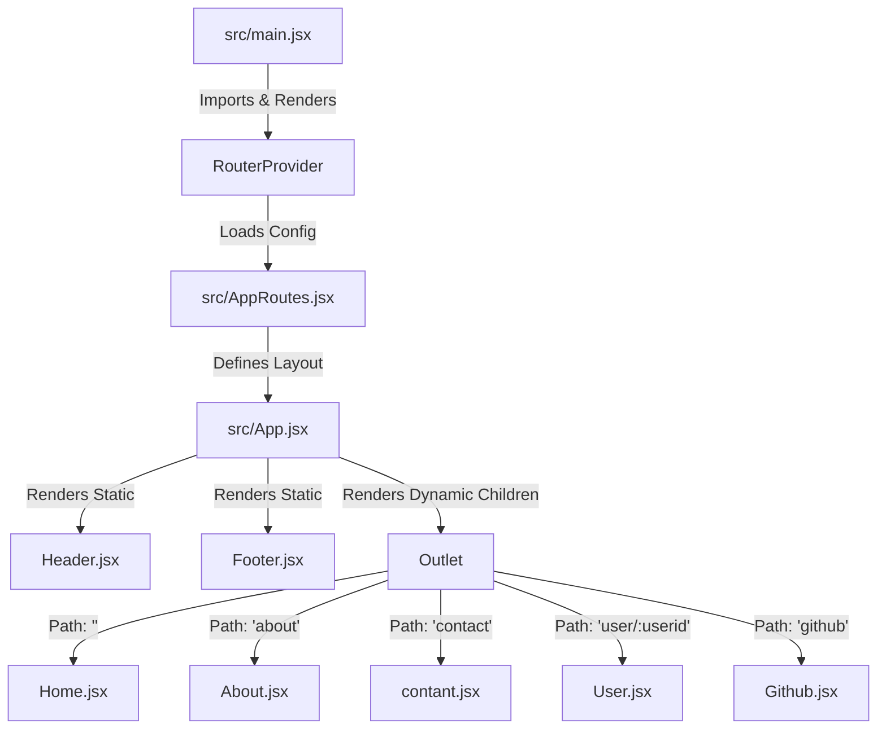

# 🌟 React Router DOM Implementation Guide

This project (**07reactRouter**) is a hands-on implementation of client-side routing in a modern React application. It uses **React 19**, **Vite**, **Tailwind CSS**, and **React Router DOM v7** to demonstrate how to build multi-page user experiences efficiently without full page refreshes.

---

## 📖 Core Concepts of Client-Side Routing

### 1. Client-Side Routing vs. Server-Side Routing
* **Server-Side Routing:** When a user clicks a link, the browser requests a new HTML document from the server. This causes the entire page to reload, leading to slower transitions and a flashing blank screen.
* **Client-Side Routing:** The app intercepts page requests. Instead of fetching a new HTML page from the server, React Router DOM dynamically updates the URL in the address bar and re-renders only the components that need to change. This results in a fast, seamless single-page application (SPA) experience.

### 2. Why Avoid `<a>` Tags?
In standard HTML, we use the anchor tag `<a>` for navigation:
```html
<!-- Avoid this in React! -->
<a href="/about">About Us</a>
```
**Problem:** Clicking this tag forces a full browser reload, discarding the current React state and making the page load slower.

**Solution:** React Router DOM provides `<Link>` and `<NavLink>` components. They update the URL using the browser's History API without triggering a full page refresh:
```jsx
import { Link } from 'react-router-dom';

<Link to="/about">About Us</Link>
```

---

## 🛠️ Project Architecture & Router Setup

Our project uses the **Data Router** approach (`createBrowserRouter` & `RouterProvider`), which is the recommended method in modern React Router applications.



### 1. Defining the Routes: `AppRoutes.jsx`
In `src/AppRoutes.jsx`, we define our routes array using `createBrowserRouter`. This is where we declare layouts, children routes, path parameters, and loaders.

📂 **File:** [src/AppRoutes.jsx](file:///D:/3_Learning/Unstoppable/ReactChaiAurCode/07reactRouter/src/AppRoutes.jsx)
```jsx
import { createBrowserRouter } from "react-router-dom";
import Home from "./components/Home/Home.jsx";
import About from "./components/About/About.jsx";
import Contact from "./components/Contact/contant.jsx";
import User from "./components/User/User.jsx";
import Github from "./components/Github/Github.jsx";
import { githubInfoLoader } from "./components/loaders/githubLoader.js";
import App from "./App.jsx";

export const router = createBrowserRouter([
  {
    path: "/",
    element: <App />, // Root layout component
    children: [
      { path: "", element: <Home /> },
      { path: "about", element: <About /> },
      { path: "contact", element: <Contact /> },
      { path: "user/:userid", element: <User /> }, // Dynamic route parameter
      { path: "github", element: <Github />, loader: githubInfoLoader }, // Router Loader
    ]
  }
]);
```

### 2. Providing the Router: `main.jsx`
We wrap our application in `RouterProvider` at the entry point of the app and inject the configured `router`.

📂 **File:** [src/main.jsx](file:///D:/3_Learning/Unstoppable/ReactChaiAurCode/07reactRouter/src/main.jsx)
```jsx
import { StrictMode } from 'react'
import { createRoot } from 'react-dom/client'
import './index.css'
import { RouterProvider } from 'react-router-dom'
import { router } from './AppRoutes'

createRoot(document.getElementById('root')).render(
  <StrictMode>
    <RouterProvider router={router} />
  </StrictMode>,
)
```

### 3. Creating the Layout with `<Outlet />`: `App.jsx`
To prevent code duplication, we use a single layout component (`App.jsx`) containing headers and footers that remain static. The `<Outlet />` component tells React Router where to render the matching nested child component.

📂 **File:** [src/App.jsx](file:///D:/3_Learning/Unstoppable/ReactChaiAurCode/07reactRouter/src/App.jsx)
```jsx
import Header from "./components/Header/Header.jsx";
import Footer from "./components/Footer/Footer.jsx";
import { Outlet } from "react-router-dom";

export default function App() {
  return (
    <>
      <Header />
      <Outlet /> {/* Child components (Home, About, Contact, etc.) will render here */}
      <Footer />
    </>
  );
}
```

---

## ⚡ Key React Router DOM Features Used

### 1. Active Navigation States with `<NavLink>`
`<NavLink>` is a special version of `<Link>` that knows whether or not it is active. This allows us to style the active link differently.

We pass a function to the `className` attribute. This function receives an object with an `isActive` property, which we use to dynamically apply active styling classes:

📂 **File Excerpt:** [src/components/Header/Header.jsx](file:///D:/3_Learning/Unstoppable/ReactChaiAurCode/07reactRouter/src/components/Header/Header.jsx#L37-L46)
```jsx
<NavLink
  to="/"
  className={({ isActive }) =>
    `block py-2 pr-4 pl-3 duration-200 ${
      isActive ? "text-orange-700" : "text-gray-700"
    } border-b border-gray-100 hover:bg-gray-50 lg:hover:bg-transparent lg:border-0 hover:text-orange-700 lg:p-0`
  }
>
  Home
</NavLink>
```
* If the user is on the `/` route, `isActive` is `true` and the text turns orange (`text-orange-700`).
* Otherwise, the text remains gray (`text-gray-700`).

---

### 2. Dynamic Routing & Dynamic Params (`useParams`)
Dynamic routing allows us to match paths like `/user/123`, `/user/456`, or `/user/sam` using wildcards.

#### Route configuration:
```jsx
{
  path: "user/:userid",
  element: <User />
}
```
* `:userid` acts as a dynamic placeholder variable.

#### Retrieving Route Params:
We use the `useParams` hook inside the component to extract the dynamic value from the URL.

📂 **File:** [src/components/User/User.jsx](file:///D:/3_Learning/Unstoppable/ReactChaiAurCode/07reactRouter/src/components/User/User.jsx)
```jsx
import { useParams } from 'react-router-dom'

function User() {
  // Extracting 'userid' param from URL
  const { userid } = useParams();

  return (
    <div className='bg-gray-600 text-white text-center text-5xl italic p-4 mt-15'>
      User: {userid}
    </div>
  )
}

export default User;
```

---

### 3. Data Optimization with Loaders (`useLoaderData`)
Traditionally in React, you fetch data using a `useEffect` hook *after* the component renders:
1. Component mounts (shows loading state/empty screen).
2. `useEffect` fires.
3. Fetch request completes.
4. Component re-renders with new data.

This is known as a **Render-then-Fetch** waterfall, which can feel slow.

#### The Loader Approach (Fetch-then-Render)
React Router DOM loaders allow you to define a loader function that fetches data **during** the route transition, *before* the component is even rendered.

#### Step A: Write the Loader Function
Create an asynchronous function to fetch data and return the response.

📂 **File:** [src/components/loaders/githubLoader.js](file:///D:/3_Learning/Unstoppable/ReactChaiAurCode/07reactRouter/src/components/loaders/githubLoader.js)
```javascript
export const githubInfoLoader = async () => {
  const response = await fetch(
    "https://api.github.com/users/DeveloperSRGonline"
  );
  return response.json(); // Returns a promise which resolves to the data
};
```

#### Step B: Attach the Loader to the Route
Attach the loader function to the `/github` route configuration.

📂 **File Excerpt:** [src/AppRoutes.jsx](file:///D:/3_Learning/Unstoppable/ReactChaiAurCode/07reactRouter/src/AppRoutes.jsx#L19)
```jsx
{
  path: "github",
  element: <Github />,
  loader: githubInfoLoader // Fetches data as soon as route transition starts
}
```

#### Step C: Consume Data with `useLoaderData`
Inside the component, retrieve the preloaded data using the `useLoaderData` hook.

📂 **File:** [src/components/Github/Github.jsx](file:///D:/3_Learning/Unstoppable/ReactChaiAurCode/07reactRouter/src/components/Github/Github.jsx)
```jsx
import { useLoaderData } from "react-router-dom";

const Github = () => {
  // Data is already fetched and resolved here automatically by the router
  const data = useLoaderData(); 

  return (
    <div className="text-center m-4 text-white flex flex-col items-center justify-center gap-10 p-4 text-3xl mt-15">
      
      <h1 className="font-bold text-6xl text-[#DB5746]">{data?.login}</h1>
      <h1 className="font-bold text-3xl text-black">
        <span className="font-normal font-sans">Followers:</span>{" "}
        <span className="text-[#DB5746]">{data?.followers}</span>
      </h1>
    </div>
  );
};

export default Github;
```

---

## 📋 React Router Hooks & Components Cheat Sheet

| API Name | Type | Purpose | Example Usage in Project |
| :--- | :--- | :--- | :--- |
| `createBrowserRouter` | Function | Configures routes and nested layout hierarchy. | [AppRoutes.jsx](file:///D:/3_Learning/Unstoppable/ReactChaiAurCode/07reactRouter/src/AppRoutes.jsx) |
| `RouterProvider` | Component | Context provider that renders the router configuration. | [main.jsx](file:///D:/3_Learning/Unstoppable/ReactChaiAurCode/07reactRouter/src/main.jsx) |
| `<Outlet />` | Component | A placeholder component rendering the matched child route. | [App.jsx](file:///D:/3_Learning/Unstoppable/ReactChaiAurCode/07reactRouter/src/App.jsx) |
| `<Link>` | Component | Navigates between views without reloading the page. | [Header.jsx](file:///D:/3_Learning/Unstoppable/ReactChaiAurCode/07reactRouter/src/components/Header/Header.jsx) |
| `<NavLink>` | Component | A navigation link that applies active styling state. | [Header.jsx](file:///D:/3_Learning/Unstoppable/ReactChaiAurCode/07reactRouter/src/components/Header/Header.jsx) |
| `useParams` | Hook | Extracts dynamic parameters from the active URL path. | [User.jsx](file:///D:/3_Learning/Unstoppable/ReactChaiAurCode/07reactRouter/src/components/User/User.jsx) |
| `useLoaderData` | Hook | Reads preloaded loader data before the component renders. | [Github.jsx](file:///D:/3_Learning/Unstoppable/ReactChaiAurCode/07reactRouter/src/components/Github/Github.jsx) |
